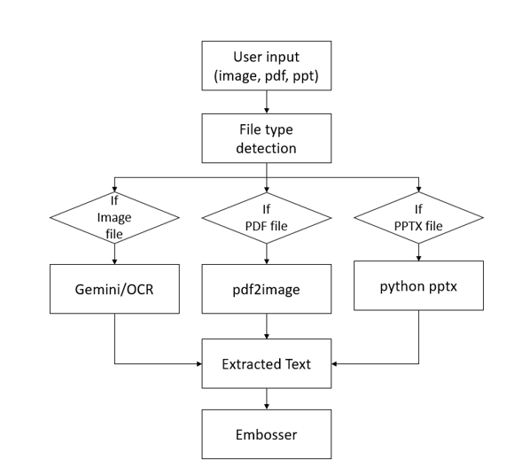
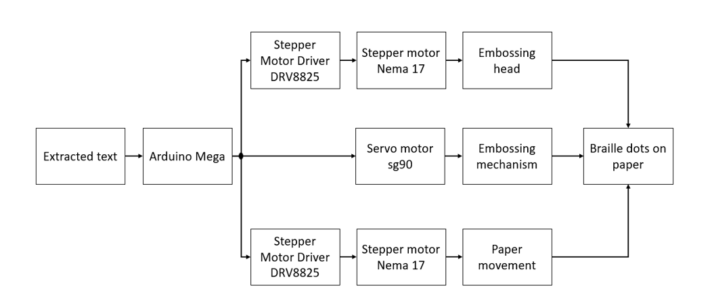
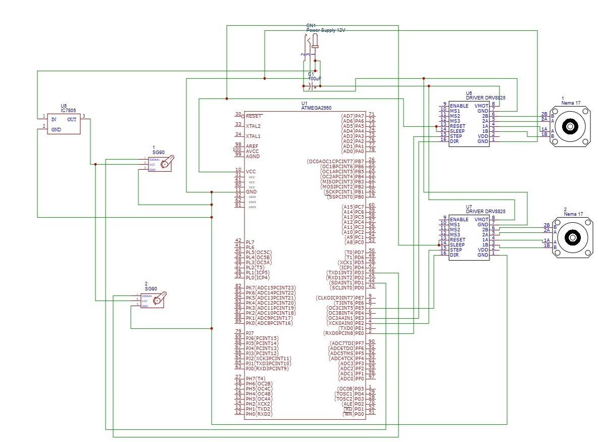
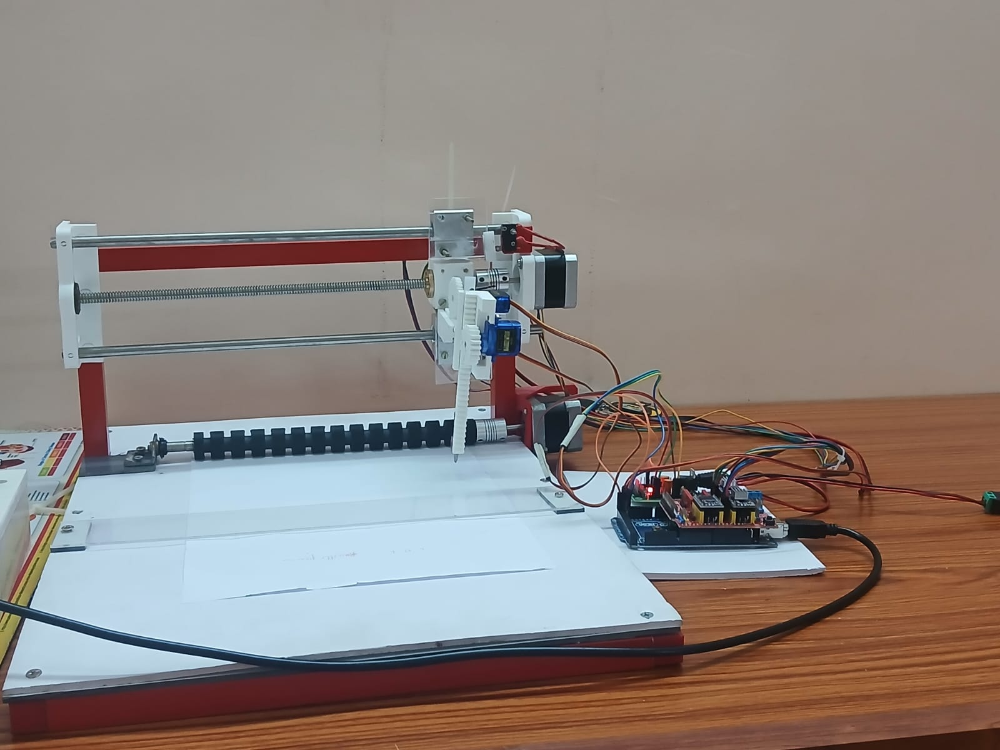

# BrailleGen: A Low-Cost Braille Embosser

## Overview

## Overview
BrailleGen is a low-cost AI-powered Braille embosser developed to improve accessibility for visually impaired individuals by converting handwritten and digital text into tactile Braille output. The system supports multiple input formats such as images, PDF files and PPT, making it suitable for educational and real-world applications.The project integrates artificial OCR, embedded systems, and mechanical embossing technologies to provide an efficient and affordable assistive solution. Google Gemini is used as the primary text extraction tool, while EasyOCR acts as a fallback mechanism to improve reliability and accuracy. The extracted content is translated into Grade 2 Unified English Braille (UEB) and Nemeth Code for mathematical expressions.The processed Braille data is converted into binary format and transmitted to an Arduino-based hardware system that controls stepper and servo motors for precise embossing. By combining intelligent software with cost-effective hardware components, BrailleGen provides an accessible and user-friendly solution that promotes independent learning and communication for visually impaired users.

## Objectives
- Provide affordable Braille accessibility
- Support multiple input formats
- Improve OCR accuracy using AI
- Enable educational accessibility
- Develop an efficient embossing mechanism

## Features
- Handwritten text recognition
- AI-based OCR using Google Gemini
- EasyOCR fallback mechanism
- Support for image, PDF, and PPT inputs
- Grade 2 Unified English Braille (UEB) conversion
- Nemeth code support for mathematical expressions
- Arduino-based embossing mechanism
- Low-cost design
- Real-time software and hardware integration

## Technologies Used

### Software Technologies
- Python
- Google Gemini API
- EasyOCR
- pdf2image
- python-pptx
- PySerial

### Hardware Technologies
- Arduino Mega 2560
- NEMA 17 Stepper Motors
- SG90 Servo Motor
- DRV8825 Motor Driver
- CNC Shield
- Linear Guide Rods

## Requirements

pip install google-generativeai easyocr opencv-python numpy pyserial python-pptx pdf2image pillow

## Working Principle

1. User uploads an image, PDF, or PPT file
2. System detects the file type
3. Text is extracted using Google Gemini if Gemini falls EasyOCR will extract text
4. Extracted text is transmitted to Arduino Mega through serial communication
5. Stepper and servo motors emboss Braille dots on paper

## Block Diagram

## Schematic Diagram

## Prototype

## Applications
- Educational institutions
- Libraries
- Assistive technology
- Accessibility solutions
- Personal learning systems

## Future Improvements
- Faster embossing mechanism
- Multi-language Braille support
- Offline AI processing
- Wireless connectivity
- Mobile application integration

## Team Members
- Akhil M Deepak
- Devika K
- Diya Vijayan V D
- Lakshmi Prakash S
- Namitha Mariyam Joji

## Project Report

## Demo Video

## License
This project is licensed under the MIT License.
